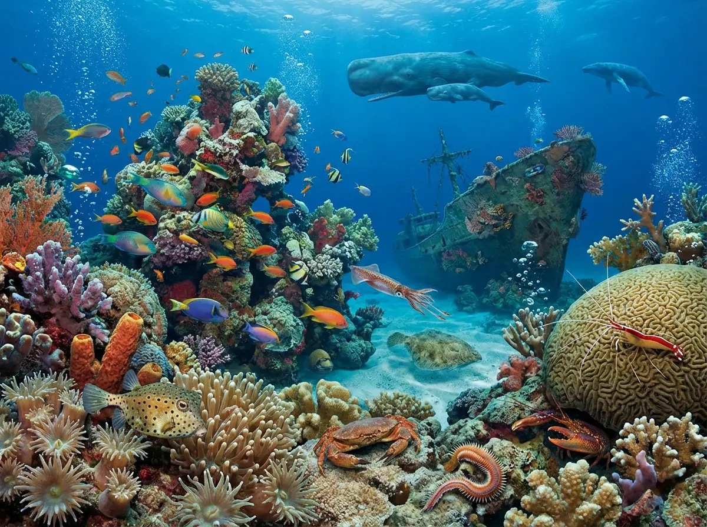
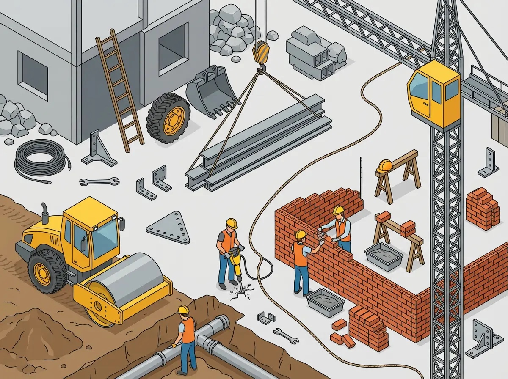
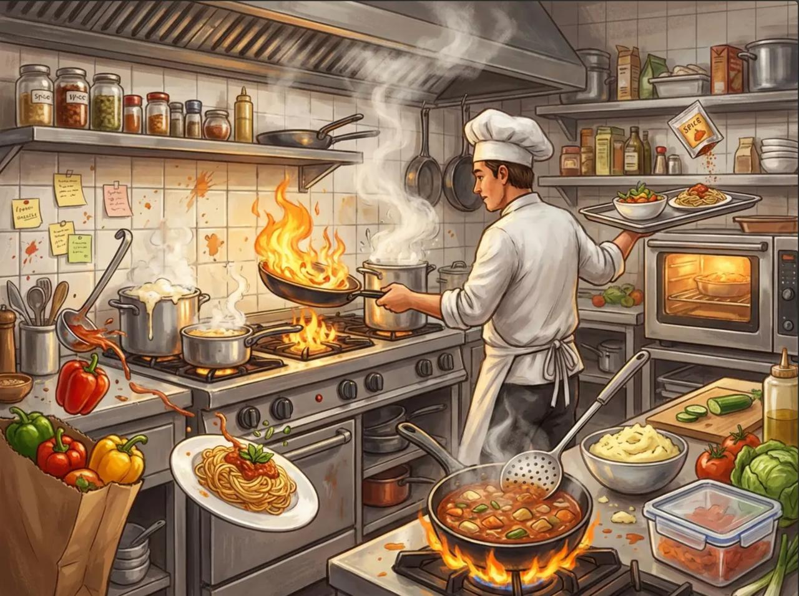
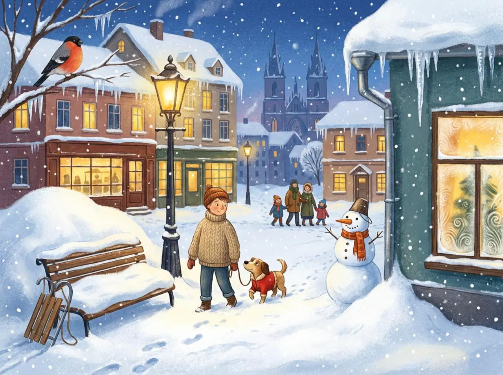
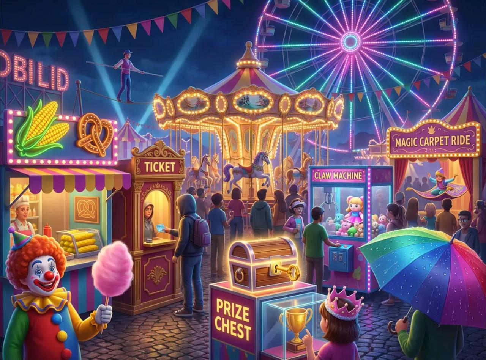
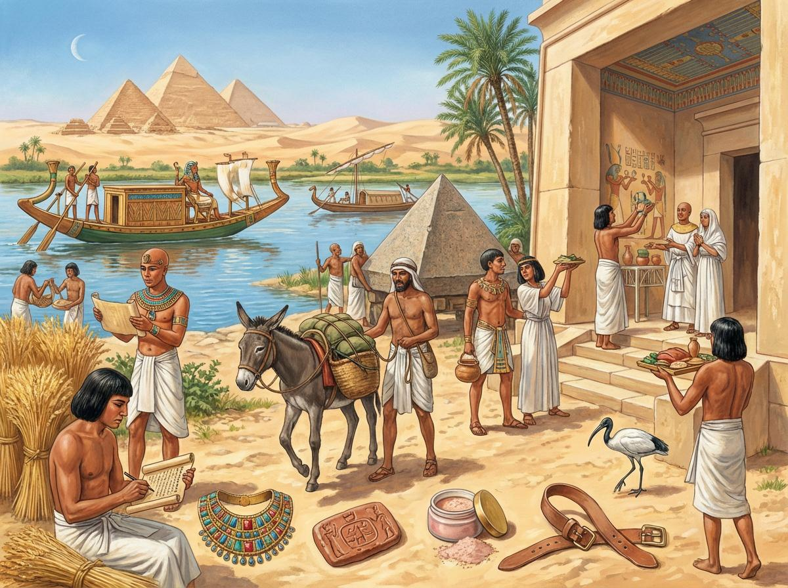
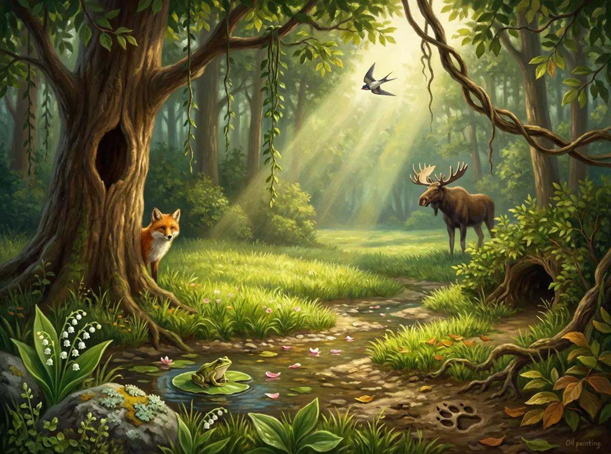
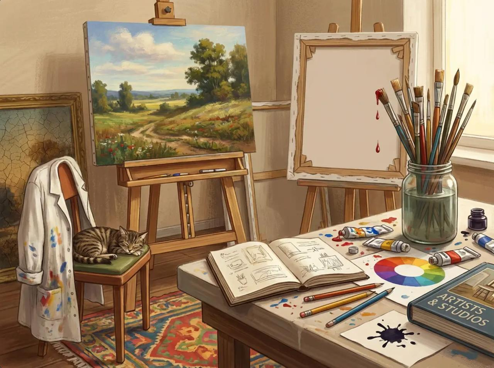

# Исторические механики и prompts

Материал перенесён из рабочей knowledge-base. Списки слов и prompts не прошли
полный content QA: в них встречаются повторы, спорные существительные и ссылки
на чужие стили. Используйте их как источник и проверяйте заново перед выпуском.

Игра из тейблтайм. Генерация ИИ. Настолка с напечатанными изображениями, где нужно угадать максимальное количество слов на какую-то букву
[Site Unreachable](https://vkvideo.ru/playlist/-203677279_9/video-203677279_456242109?linked=1)
можно
- давать больше времени
- не ограничиваться одной буквой
- кубик бросать. можно перебрасывать в ход времени

## Идеи по игровому процессу
### 1. Механики, добавляющие вариативности в каждый раунд

**Динамический выбор буквы:**
*   **Буква с кубика:** Сделайте кубик с буквами (например, Ч, П, К, Л, С, Т). Выпавшая буква — целевая для всех в этом раунде.
*   **Карты букв:** Колода карт с разными буквами. В начале раунда тянется одна карта. Это позволяет использовать редкие буквы (Й, Ы, Ъ), создавая уникальные вызовы.
*   **"Своя буква":** Каждый игрок в тайне получает свою букву и ищет предметы только на нее, а потом все пытаются угадать, какая у кого была буква.

**Изменение условий победы:**
*   **Количество vs. Уникальность:** Можно давать бонусы не только за количество, но и за предмет, который никто другой не нашел.
*   **Длинные слова:** Дополнительные очки за слово, состоящее из 5, 6, 7+ букв.
*   **Темпоральный режим:** "Раунд на 60 секунд" — кто найдет больше всех за это время.

### 2. Уровни сложности и модификаторы

Это можно реализовать с помощью отдельной колоды "Испытаний" или дополнительного кубика.

*   **Простое:** Найти 5 предметов на выбранную букву.
*   **Среднее:** Найти 3 предмета, названия которых начинаются на одну букву и состоят из двух слогов.
*   **Сложное:** Найти предметы, которые объединены не только буквой, но и логической цепочкой. Например, на букву «К» в саванне: **К**уст -> **К**оза (которая его ест) -> **К**огти (у леопарда, который охотится на козу).

**Модификаторы раунда (вытягивается карта):**
*   **"Запретная зона":** Нельзя называть предметы в определенной части картинки (например, "нельзя называть то, что на небе").
*   **"Синонимы":** Можно засчитывать предмет, если игрок называет его синонимом на нужную букву. (Например, для "Солнца" на букву "С" подходит "Светило").
*   **"Только живое" / "Т вое".**
*   **"Детализация":** Засчитываются только части целого (например, для корабля: "**К**иль", "**К**орма", "**К**ожух").

### 3. Повышение реиграбельности (одна картинка — много игр)

Суть в том, чтобы одна и та же картинка приносила новый опыт.

*   **Разные колоды заданий:** У вас может быть несколько колод карточек, которые меняют цель игры для одной и той же картинки:
    *   **Колода "Буквы".**
    *   **Колода "Цвета"** (найти как можно больше предметов красного цвета).
    *   **Колода "Формы"** (найти круглые, острые, прямоугольные объекты).
    *   **Колода "Действия"** (что на картинке может *издавать звук*, *пахнуть*, *двигаться*?).
*   **Система "уровней" картинки:** На обратной стороне каждой картинки может быть список из 10-15 сложных/неочевидных предметов. После того как все простые варианты найдены, игроки могут бросить себе вызов, открыв этот список и попытаясь найти все зашифрованные объекты. Это как "достижения" в видеоигре.

### 4. Добавление игрового взаимодействия (конфликта и кооперации)

**Конкурентные режимы:**
*   **"Закрыть тему":** Игрок, назвавший слово, "закрывает" этот предмет. Другие игроки не могут его использовать. Это заставляет искать все более неочевидные варианты.
*   **"Вызов":** Если игрок сомневается в существовании названного соперником предмета, он может бросить вызов. Если предмет на картинке действительно есть (или логически обоснован), вызывающий теряет очко. Если нет — теряет очко назвавший.
*   **"Дуэль":** Два игрока одновременно смотрят на картинку. Ведущий засекает 30 секунд. Кто найдет больше слов на свою букву (можно выдавать одинаковые), тот и победил.

**Кооперативные режимы:**
*   **"Общая цель":** Вся команда должна вместе найти, например, 15 предметов на букву "П" за 3 минуты.
*   **"Эстафета":** Игроки по кругу называют по одному предмету на заданную букву. Не можешь назвать — выбываешь. Последний оставшийся получает бонус.

### 5. Компоненты и "фишки" для усиления атмосферы

*   **Таймер-песочница:** Создает приятное тактильное ощущение и напряжение.
*   **Специальные жетоны:** Игроки кладут жетоны на найденные предметы на большой картинке, чтобы не повторяться. Это еще и визуально красиво.
*   **Блокноты для записей:** Стилизованные под бортовой журнал (для темы "Космос") или древний свиток (для "Древнего Египта").

---

### Пример сборки игровой сессии:

**Раунд 1 (Космос):**
*   **Механика:** Базовая. Тяним карту буквы — выпала **"С"**.
*   **Цель:** Каждый сам за себя, написать на своем листочке как можно больше слов.

**Раунд 2 (Африканская саванна):**
*   **Механика:** С модификатором. Тяним карту модификатора — выпало **"Только живое"**.
*   **Цель:** Командная. Найти 12 предметов на букву **"Ж"** за 2 минуты.

**Раунд 3 (Ярмарка):**
*   **Механика:** Конкурентная с взаимодействием. Буква **"К"**.
*   **Цель:** Играем с правилом **"Закрыть тему"**. Каждый названный и подтвержденный предмет отмечается жетоном и больше не используется.

Такой подход гарантирует, что даже с одним и тем же набором картинок игра будет каждый раз ощущаться по-новому. Удачи в создании!

## Примеры тематик-картинок
### 1. Тема: **Африканская саванна**
**Лучшая буква:** **С**
**Слова (20):** Слон, Страус, Солнце, Саванна, Скала, Степь, Сурик, Суслик, Стервятник, Спица (трава), Стрекоза, Сумерки, Следы, Соцветие, Смоковница, Самец, Самка, Стадо, Скарабей, Сушь.

**Промпт:**
> A vibrant, detailed panoramic illustration of an African savanna at sunset. The scene must include: an elephant, an ostrich, the bright sun, rocky outcrops, dry steppe grass, a squirrel, a vulture, a zebra (striped animal), a dragonfly, long shadows (traces), blooming flowers, a fig tree, a male lion, a female lion, a herd of antelope, a dung beetle, and dry earth. All elements should be naturally integrated and distributed across the entire image, creating a rich and busy scene. Style: National Geographic realism.

_Исходное изображение саванны в knowledge-base отсутствовало._

---

### 2. Тема: **Космос**
**Лучшая буква:** **З**
**Слова (18):** Звезда, Земля, Зонд, Затмение, Зенит, Зодиак, Заря (полярная), Зеркало (телескопа), Зона (обитания), Зонд, Звук (условно, символ радиоволн), Закон (гравитации, символ), Запаска (часть оборудования), Замок (стыковочный), Завиток (галактики), Закат (на планете), Зигзаг (траектории), Зал (в космической станции).

**Промпт:**
> A majestic and educational illustration of space. The composition must include: a bright star, the planet Earth, a space probe, a solar eclipse, the zenith point, zodiac constellations, an aurora, the mirror of a large telescope, a habitable zone diagram, another probe, symbolic radio waves, a representation of the law of gravity, a spare equipment part, a docking mechanism on a space station, a spiral galaxy, a sunset viewed from another planet, a zigzag trajectory line, and the interior of a space station module. Distribute these elements creatively across the cosmic canvas, blending celestial bodies with human technology. Style: Digital painting, mix of realism and infographic clarity.

_Вариант изображения был помечен как неудачный и не переносился._

---

### 3. Тема: **Подводный мир**
**Лучшая буква:** **К**
**Слова (19):** Коралл, Кит, Краб, Кальмар, Камбала, Креветка, Кашалот, Коралловый риф, Кораблекрушение, Кислород (пузыри), Крупная рыба, Кузовок-рыба, Кольчатый червь, Коралловый песок, Каменистое дно, Креветка-чистильщик, Коготь (лобстера), Китёнок, Коралловый полип.

**Промпт:**
> A lush and bustling illustration of a coral reef ecosystem. The scene must include: various corals, a whale in the distance, a crab on the seabed, a squid, a flounder, shrimp, a sperm whale, a vibrant coral reef structure, a sunken shipwreck, oxygen bubbles rising, a large school of fish, a boxfish, a marine worm, coral sand, a rocky seabed, a cleaner shrimp on coral, a lobster's claw, a whale calf, and detailed coral polyps. Fill the entire image with life and texture, from the foreground to the deep blue background. Style: Photorealistic underwater scene.

---

### 4. Тема: **Строительная площадка**
**Лучшая буква:** **К**
**Слова (20):** Кран, Кирпич, Каска, Каток (дорожный), Канава, Канат, Ковш, Колесо, Лестница, Кабина, Камень, Канализация, Крепление, Косынка (металлическая), Керн (отбойный молоток), Кабели, Корыто (для раствора), Козлы (строительные), Ключ (гаечный), Кирпичная кладка.

**Промпт:**
> A busy, dynamic construction site during the day. The image must include: a tall crane, stacks of bricks, a worker's helmet, a road roller, a trench, a rope/cable, an excavator bucket, a wheel from machinery, a ladder, a crane cabin, piles of stone, sewer pipes, metal brackets, a triangular metal gusset plate, a jackhammer breaking concrete, a coil of cables, a mortar tub, sawhorses, a wrench on the ground, and a wall being built with brickwork. Scatter these elements logically across the site to create a sense of active work. Style: Detailed vector illustration with a slightly elevated, isometric view.

---

### 5. Тема: **Кухня ресторана**
**Лучшая буква:** **П**
**Слова (20):** Повар, Плита, Половник, Посуда, Пар, Паста, Перец, Поднос, Пакет, Пакетик (специй), Полка, Плитка (кухонный фартук), Пена (на супе), Пламя, Поварёшка, Приправа, Печь, Продукты, Пюре, Пластиковая ёмкость.

**Промпт:**
> A chaotic and energetic illustration of a professional restaurant kitchen in action. The scene must include: a chef in uniform, a stove with multiple burners, a ladle, various pots and pans (cookware), steam rising from a pot, a plate of pasta, bell peppers, a serving tray, a grocery bag, a small spice sachet, a shelf with ingredients, kitchen wall tiles, foam on a simmering stew, flames under a pan, another cooking spoon (skimmer), jars of spices, an oven, fresh produce on a counter, mashed potatoes in a bowl, and a plastic container. Fill the entire frame with details, creating a sense of organized chaos. Style: Warm, inviting digital painting with a focus on textures like metal, steam, and food.

---

### 6. Тема: **Зимний вечер в городе**
**Лучшая буква:** **С**
**Слова (20):** Снег, Сосулька, Сугроб, Скамейка, Фонарь, Снеговик, Санки, Свитер, Снегирь, Снежинки, Сугроб, Стекло (замерзшее), Следы (на снегу), Сумерки, Свет (окон), Собака (в одежде), Сосуля, Снегопад, Свита (группа людей), Собор (на заднем плане).

**Промпт:**
> A cozy, detailed illustration of a city street on a snowy evening. The scene must include: falling snow, icicles hanging from roofs, a large snowdrift, a park bench covered in snow, a glowing street lamp, a snowman, a sled, a person in a warm sweater, a bullfinch on a branch, many detailed snowflakes, another snowdrift, a frozen window pane with frost patterns, footprints in the snow, the deep blue of twilight, warm light from house windows, a dog in a jacket, a large icicle, a heavy snowfall, a small group of people walking, and a cathedral silhouette in the background. Create a peaceful, festive atmosphere. Style: Stylized digital art, inspired by children's book illustrations.

---

### 7. Тема: **Ярмарка / Парк развлечений**
**Лучшая буква:** **К**
**Слова (19):** Карусель, Конфета, Клоун, Колесо обозрения, Кукла, Канат, Киоск, Кукуруза (вареная), Касса, Карнавал, Корона (сладостная), Ковёр (магический), Кабинал (аттракциона), Капкан (игра "поймай приз"), Ключ (от сундука с призами), Кубок (приз), Капюшон (у персонажа), Крендель, Капля (дождя на зонте).

**Промпт:**
> A vibrant, crowded illustration of a bustling fairground at night. The scene must include: a spinning carousel, a stick of candy floss (or candy apple), a cheerful clown, a giant Ferris wheel, a prize doll, a tightrope, a colorful stall/kiosk, corn on the cob, a ticket booth, carnival banners, a sugary crown, a magic carpet ride attraction, the booth of an attraction, a "claw machine" game, a key for a prize chest, a trophy prize, a character in a hooded jacket, a pretzel, and a raindrop on an umbrella. The image should be packed with lights, people, and attractions from foreground to background. Style: Bright, saturated, 3D render style with glowing lights.

---

### 8. Тема: **Древний Египет**
**Лучшая буква:** **П**
**Слова (19):** Пирамида, Папирус, Фараон, Пальма, Песок, Погонщик, Пирамидион, Пектораль, Писец, Погребальная ладья, Поднос (с дарами), Полумесяц (символ), Потолок (расписной), Приношение, Пряжка (сандáлий), Пшеница, Птица (ибис), Пудра (косметическая), Печать.

**Промпт:**
> A detailed historical illustration of a bustling scene in Ancient Egypt by the Nile. The composition must include: pyramids in the distance, a scribe holding a papyrus scroll, a pharaoh, date palms, endless sand dunes, a donkey driver, the capstone of a pyramid (pyramidion), a jeweled pectoral collar, the scribe writing, a funeral boat on the river, an offering tray with food, a crescent moon symbol, a painted temple ceiling, people making offerings, a sandal strap with a buckle, sheaves of wheat, an ibis bird, a cosmetic jar with powder, and a royal seal. Combine monumental architecture with daily life. Style: Historical reconstruction painting, realistic and atmospheric.

---

### 9. Тема: **Лесная поляна**
**Лучшая буква:** **Л**
**Слова (20):** Листок, Лиса, Лягушка, Ландыш, Лужайка, Луч (солнечный), Лужа, Ласточка, Лиана, Лось, Луг, Лес, Лоза, Лапа (звериная), Лунка (в дереве), Лубок (кора), Лишайник, Лепесток, Ложе (ручья), Лазейка (в кустах).

**Промпт:**
> A serene and sun-dappled illustration of a forest clearing. The scene must include: various leaves on trees and ground, a fox peeking from behind a tree, a frog on a lily pad, lily of the valley flowers, a sunny grassy clearing (lawn), a ray of sunlight breaking through the canopy, a puddle, a swallow flying, hanging vines, a moose at the edge of the clearing, a wider meadow (glade), the dense forest in the background, a woody vine, an animal's paw print in the mud, a hollow in a tree trunk, a piece of tree bark, lichen on a rock, flower petals floating in a stream, a shallow stream bed, and a small tunnel through the underbrush. Create a sense of peace and hidden life. Style: Painterly, realistic style with a focus on light and texture.

---

### 10. Тема: **Мастерская художника**
**Лучшая буква:** **К**
**Слова (19):** Кисть, Картина, Краска, Холст, Мольберт, Эскиз, Баночка, Капля, Карандаш, Клякса, Книга (альбом), Колесо (цветовой круг), Крышка (от баночки), Костюм (художника, запачканный), Кот (спящий), Коврик, Кромка (холста), Кракелюр (трещина в краске), Кирка (для натяжки холста).

**Промпт:**
> A cozy, slightly messy illustration of an artist's studio. The scene must include: multiple paintbrushes, a finished painting on an easel, tubes and splatters of paint, a blank canvas on a second easel, the main easel, a sketchbook with drawings, a jar of murky water, a drop of paint falling, pencils on a table, an ink blot, an art book/album, a color wheel, a lid from a paint tube, the artist's paint-stained smock, a cat sleeping on a chair, a rug on the floor, the raw edge of a canvas, a crackle texture in an old painting, and a canvas stretcher. Fill the space with creative clutter. Style: Warm, textured digital painting with a focus on the tools of the trade.

## Как продать?

### Шаг 1: Создайте «минимально жизнеспособный продукт» (MVP)

Не нужно сразу печатать тысячу коробок. Ваша цель — создать **прототип для демонстрации**.

1.  **Дизайн в цифре:** Сделайте красивые файлы ваших картинок (те, что мы описали в промптах) и правил игры в PDF. Пока не печатайте.
2.  **Печать «на заказ»:** Для первых продаж используйте сервисы **печати по требованию** для настольных игр, например:
    *   **The Game Crafter** (международный)
    *   **MakePlayingCards.com** (подходит для карт)
    *   Российские аналоги: типографии, которые печатают малые тиражи настольных игр (найти через Яндекс).
    Вы напечатаете ровно столько копий, сколько у вас есть реальных заказов.

### Шаг 2: Проверка спроса и первые продажи (Самый простой способ)

**Площадка №1: Boomstarter (или аналогичная крауд-платформа для творческих проектов)**

Это не полноценный краудфандинг с огромными обязательствами, а идеальный инструмент для проверки спроса.

*   **Что делать:** Создайте простой и яркий проект.
*   **Что показать:**
    *   3-4 ваши самые красивые сгенерированные картинки.
    *   Видео на 1 минуту, где вы объясняете суть игры: "Смотрите на картинку и находите слова на букву...".
    *   Описание механик и того, почему это весело.
*   **Что предложить:** Самый простой набор «Награды» — это **«Цифровая версия игры»**.
    *   За 300-500 рублей backers получают все файлы для самостоятельной печати: карточки с картинками высокого качества, правила игры, поле (если есть).
    *   Это идеальный способ проверить, готовы ли люди платить за вашу идею, вообще без ваших затрат на логистику.

**Площадка №2: VK и Telegram-сообщества**

Это ваша тестовая аудитория.

1.  **Найдите целевые сообщества:**
    *   Группы для любителей настольных игр.
    *   Группы для родителей.
    *   Сообщества, посвященные головоломкам, ребусам, загадкам.
    *   Психологи и логопеды (ваша игра — отличный тренажер).
2.  **Создайте рекламный пост:**
    *   **Заголовок:** «Ищем 20 тестеров для новой настольной игры!»
    *   **Суть:** Кратко опишите игру. Покажите 1-2 картинки.
    *   **Предложение:** "Первым 20 человекам, кто оставит комментарий «Хочу протестировать», мы вышлем полную цифровую версию игры за 150 рублей (символическая цена). Нам нужна ваша обратная связь!"
    *   **ИЛИ:** "Купите цифровую версию со скидкой 50% в обмен на развернутый отзыв".

### Шаг 3: Продажа через готовые маркетплейсы

Это способ продавать, не имея своего сайта и не вкладываясь в рекламу.

*   **Avito, Юла, Дром:** Разместите объявление «Настольная игра ручной работы [Название]». Используйте картинки, описание. Укажите, что это лимитированный тираж.
*   **Ярмарка Мастеров (Livemaster):** Идеальная площадка для хенд-мейда. Позиционируйте игру как «авторскую настольную игру для семьи».

### Ключевой элемент: Где брать картинки для демонстрации?

*   **Бесплатные нейросети:** **Leonardo.Ai**, **Stable Diffusion** (через такие сервисы, как **ClipDrop**), **Midjourney** (если есть пробный период).
*   **Простое решение:** Вы можете сгенерировать всего по **одной картинке на тему** для демонстрации геймплея. Этого будет достаточно, чтобы люди поняли суть.

### Краткий план действий на первую неделю:

1.  **День 1-2:** Сгенерируйте 3-4 самые сильные картинки через нейросеть. Сверстайте простые правила в Canva или PowerPoint.
2.  **День 3:** Создайте проект на Boomstarter (это бесплатно). Снимите на телефон простое видео-представление.
3.  **День 4:** Напишите пост и разместите его в 5-10 самых крупных и подходящих сообществах VK.
4.  **День 5-7:** Анализируйте отклик. Если вам пишут и покупают цифровую версию — спрос есть! Если нет — нужно дорабатывать концепцию или презентацию.

Этот подход требует от вас минимум денег (возможно, только стоимость подписки на нейросеть) и времени, но дает максимально честный ответ на вопрос: **«А нужна ли вообще кому-то моя игра?»**.
